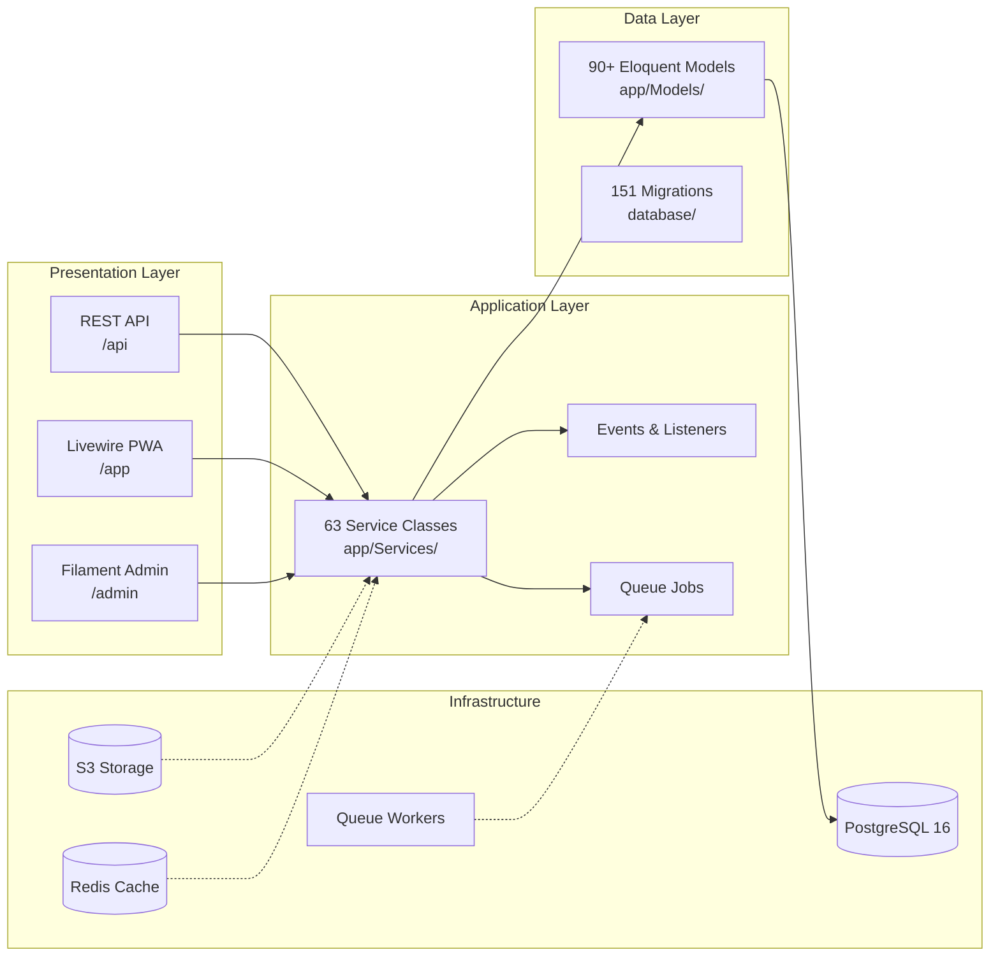
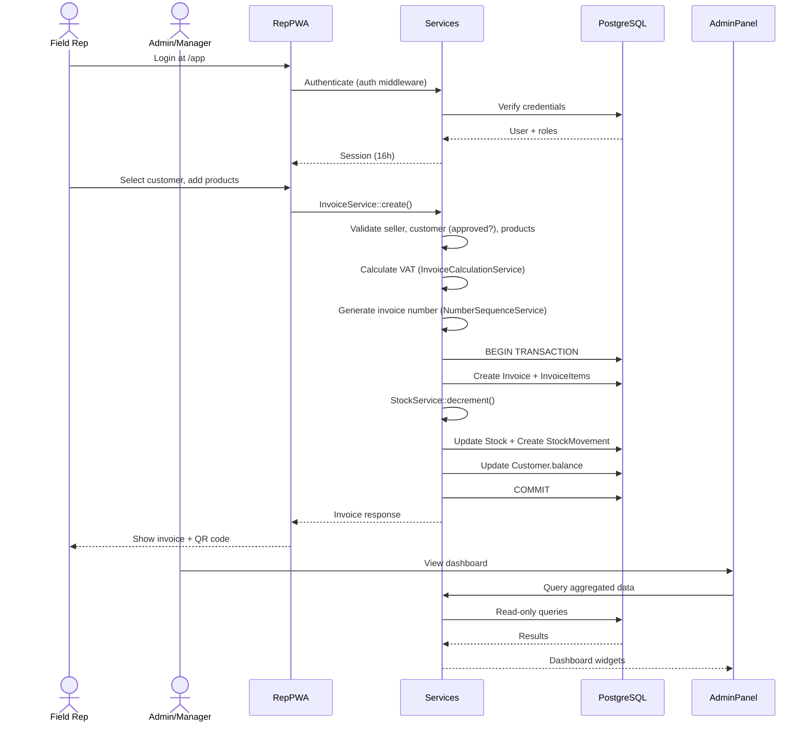

# Project Map

## 1. Workspace Overview

```text
jawla/
├── app/                    # Laravel application (Filament admin, Livewire PWA, Services, Models)
│   ├── Console/            # Artisan commands
│   ├── Data/               # Data transfer objects
│   ├── Enums/              # Status enums (InvoiceStatus, VisitStatus, etc.)
│   ├── Exceptions/         # Domain exceptions
│   ├── Filament/           # Admin panel resources, pages, widgets
│   ├── Http/               # Controllers, middleware, requests, API resources
│   ├── Livewire/           # Rep PWA components (36 components)
│   ├── Models/             # Eloquent models (90+)
│   ├── Notifications/      # Notification classes
│   ├── Observers/          # Model observers (audit)
│   ├── Policies/           # Authorization policies
│   ├── Providers/          # Service providers
│   ├── Rules/              # Validation rules
│   ├── Services/           # Business logic (63 services)
│   └── Support/            # Helper classes (ActiveCompanyContext)
├── config/                 # Laravel configuration
├── database/               # Migrations (151), seeders, factories
├── docs/                   # Architecture, business rules, security, deployment
├── docker/                 # Docker configuration (nginx, start script)
├── lang/                   # Translation files (ar, en)
├── public/                 # Web root (compiled assets, images)
├── resources/              # Blade views, JS, CSS
├── routes/                 # web.php, api.php, console.php, rep-sync.php, rep-offline.php
├── scripts/                # Deploy, backup, restore, verify scripts
├── specs/                  # Specification files
├── storage/                # Runtime logs, cache, compiled views
├── tests/                  # Pest (Feature, Unit) + Playwright (Browser, E2E)
└── vendor/                 # Composer dependencies (gitignored)
```

## 2. Applications, Services, and Packages

| Path                | Type           | Responsibility                            | Entry point                      | Depends on            | Used by            | Confidence |
| ------------------- | -------------- | ----------------------------------------- | -------------------------------- | --------------------- | ------------------ | :--------: |
| app/Filament/       | Admin Panel    | CRUD resources, dashboards, widgets       | /admin                           | Models, Services      | Admins, Managers   |    100     |
| app/Livewire/App/   | Rep PWA        | Visit flow, sales, payments, offline sync | /app                             | Services, Models      | Field reps         |    100     |
| app/Services/       | Business Logic | All domain operations                     | Called by controllers/components | Models, DB            | Entire application |    100     |
| app/Models/         | Data Layer     | Eloquent ORM models                       | Services, Controllers            | Migrations            | Services           |    100     |
| routes/web.php      | Routing        | Web routes (admin + rep PWA)              | HTTP requests                    | Controllers, Livewire | Browser            |    100     |
| routes/rep-sync.php | API            | Offline sync endpoint                     | POST /app/sync                   | SyncHandlers          | Rep PWA            |     90     |
| routes/api.php      | API            | Public API v1 (Sanctum)                   | /api/v1/*                        | Controllers           | External clients   |     85     |

## 3. Entry Points

| Entry point            | Trigger          | Initializes                      | Evidence                       |
| ---------------------- | ---------------- | -------------------------------- | ------------------------------ |
| public/index.php       | HTTP request     | Laravel kernel, middleware stack | Laravel convention             |
| routes/web.php         | Web routes       | Admin panel, Rep PWA routes      | routes/web.php:1-136           |
| routes/rep-sync.php    | Offline sync     | Sync handler registry            | AppServiceProvider.php:154-157 |
| routes/rep-offline.php | Offline snapshot | Cached read data                 | AppServiceProvider.php:160-163 |
| routes/api.php         | API requests     | Sanctum auth, API routes         | AppServiceProvider.php:149-151 |
| artisan                | CLI commands     | Artisan kernel                   | Laravel convention             |

## 4. Component Relationships



**Text explanation**: The admin panel (Filament) and rep PWA (Livewire) both delegate to the service layer. Services contain all business logic and use Eloquent models for data access. Models interact with PostgreSQL. Redis provides caching and session storage. S3 handles file storage. Queue workers process background jobs.

## 5. Data Flow



## 6. Critical Files

| File or symbol                       | Why it matters                         | Change sensitivity              | Evidence                     |
| ------------------------------------ | -------------------------------------- | ------------------------------- | ---------------------------- |
| app/Services/InvoiceService.php      | Core financial transaction logic       | High — affects all sales        | InvoiceService.php:37-190    |
| app/Services/StockService.php        | Atomic stock management                | High — inventory integrity      | StockService.php:18-141      |
| app/Services/PaymentService.php      | Cash collection logic                  | High — financial accuracy       | Services/PaymentService.php  |
| app/Providers/AppServiceProvider.php | DI bindings, rate limiters, middleware | High — affects entire app       | AppServiceProvider.php:1-206 |
| routes/web.php                       | All web routes                         | High — routing changes break UI | routes/web.php:1-136         |
| config/jawla.php                     | Application configuration              | Medium — affects behavior       | config/jawla.php:1-29        |
| docs/BUSINESS_RULES.md               | Non-negotiable rules spec              | Critical — never modify         | docs/BUSINESS_RULES.md:1-23  |
| docs/SECURITY.md                     | Security specification                 | Critical — never modify         | docs/SECURITY.md:1-124       |

## 7. Change-Sensitive Zones

| Zone                            | Reason                          | Typical blast radius | Required validation             |
| ------------------------------- | ------------------------------- | -------------------- | ------------------------------- |
| app/Services/InvoiceService.php | Financial transaction atomicity | All sales operations | make test + manual verification |
| app/Services/StockService.php   | Inventory integrity             | All stock movements  | Stock tests + edge cases        |
| app/Models/ (with company_id)   | Multi-tenancy scope             | Data isolation       | Tenancy tests                   |
| routes/web.php                  | Routing changes                 | All HTTP endpoints   | Route list + smoke tests        |
| database/migrations/            | Schema changes                  | All models + queries | Migration + rollback test       |
| app/Livewire/App/ (components)  | Rep PWA UX                      | Field rep operations | Manual testing + E2E            |

## 8. Generated, Vendored, or Protected Areas

| Path                   | Classification | How it is produced   | Editing rule         |
| ---------------------- | -------------- | -------------------- | -------------------- |
| public/build/          | Generated      | Vite build output    | Do not edit directly |
| vendor/                | Vendored       | Composer install     | Do not edit directly |
| bootstrap/cache/       | Generated      | php artisan optimize | Do not edit directly |
| storage/               | Runtime        | App execution        | Do not commit        |
| docs/BUSINESS_RULES.md | Protected      | Spec document        | Do not modify        |
| docs/SECURITY.md       | Protected      | Spec document        | Do not modify        |
| .env                   | Protected      | Environment config   | Do not commit        |

## 9. Recommended Reading Order

1. **README.md** — Project overview and quick start
2. **AGENTS.md** — Agent instructions and architecture rules
3. **docs/BUSINESS_RULES.md** — Non-negotiable business rules
4. **docs/ARCHITECTURE.md** — System architecture and data flows
5. **app/Services/InvoiceService.php** — Core financial flow
6. **app/Services/StockService.php** — Inventory management
7. **routes/web.php** — Route definitions
8. **app/Providers/AppServiceProvider.php** — DI and configuration
9. **tests/Feature/InvoiceFlowTest.php** — Invoice test patterns
10. **docs/DEPLOYMENT.md** — Deployment and operations
