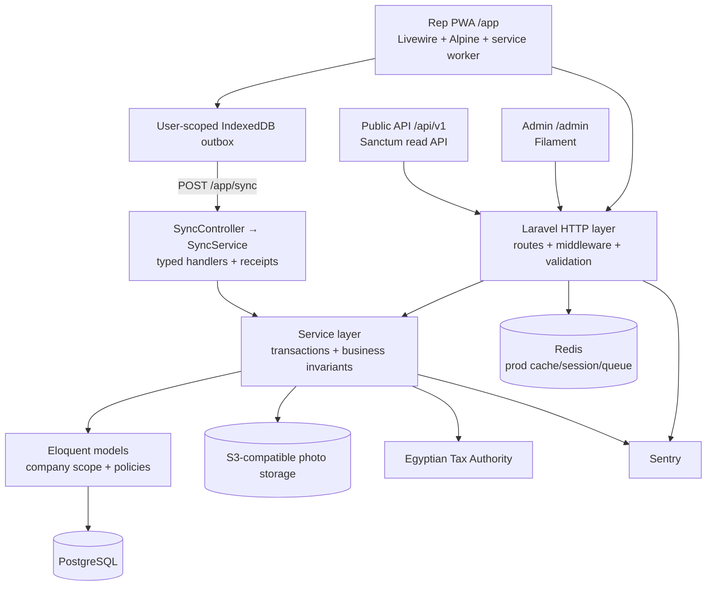
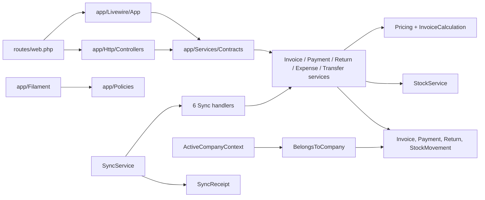
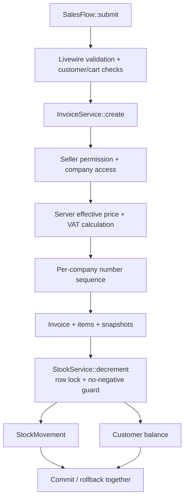
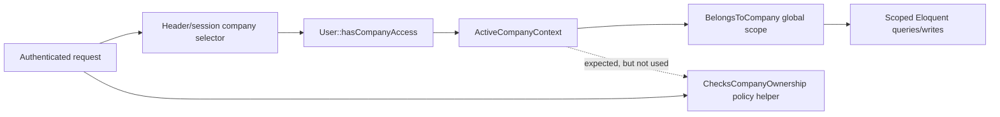
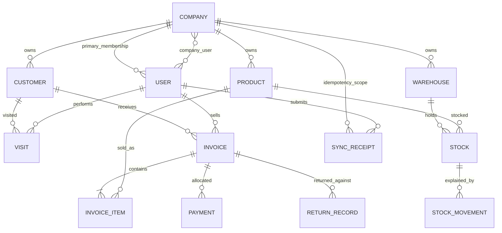

# Jawla — Project Map

**Revision:** `7b1dd3a` plus inspected working-tree changes
**Companion:** `PROJECT_EXPLORATION_REPORT.md`

## System at a glance

Jawla is one Laravel process with two authenticated user surfaces:

- `/app`: mobile-first Livewire PWA for sales reps.
- `/admin`: Filament back office for managers, finance, warehouse, purchasing, and administrators.

Both surfaces delegate business mutations to `app/Services/` and persist through Eloquent to PostgreSQL. A device-local IndexedDB outbox adds offline delivery for six rep mutation types.



Text explanation: online Livewire/Filament requests enter the ordinary Laravel web stack. Offline rep writes are first stored on the device, then replayed into a dedicated authenticated sync endpoint. Online and offline mutations converge at the same service methods.

## Directory and module map

| Path | Purpose | Important consumers / dependencies | Test surface |
|---|---|---|---|
| `app/Livewire/App/` | 24 rep PWA components | Routes, Blade views, services, scoped models | Feature and Browser tests |
| `app/Filament/` | Admin resources/pages/widgets/auth | Filament provider, policies, services | Feature/resource tests, Browser tests |
| `app/Http/Controllers/` | Thin system, auth, PDF, API, sync endpoints | Services and resources | Feature tests |
| `app/Http/Middleware/` | Company context, locale, security headers, rep role, POST throttle | Global web/admin/API route stacks | Auth/security/tenancy tests |
| `app/Services/` | Business logic and transaction boundary | Models, contracts, integrations | Unit + Feature service tests |
| `app/Services/Sync/` | Exactly-once offline replay | Sync receipt, typed handlers, domain services | OfflineSync tests |
| `app/Services/Eta/` | ETA document build, signing seam, OAuth/submit client | Invoice, HTTP client, config | Unit tests with fake HTTP |
| `app/Models/` | 68 Eloquent domain/data records | PostgreSQL, scopes, policies, resources | Factories + Feature tests |
| `app/Models/Concerns/` | Tenant and delete-protection behavior | Company-scoped/ledger models | Tenancy + finance tests |
| `app/Policies/` | Filament/domain authorization | Spatie permissions, ownership helper | Policy/role Feature tests |
| `app/Support/` | Money/GPS/value helpers, active company context, scrubbing | Services/middleware | Unit tests |
| `resources/views/` | Rep/admin/custom component Blade | Livewire/Filament | Compile/Feature/Browser tests |
| `resources/js/offline/` | IndexedDB outbox, sync engine, status | PWA layout and rep forms | Indirect Feature/Browser coverage |
| `resources/css/app.css` | Tailwind v4 tokens and component styling | Vite build | Build + Browser/a11y smoke |
| `public/sw.js` | Public asset caching and offline navigation fallback | Browser service-worker runtime | PWA asset check + Browser tests |
| `routes/` | Web, API, sync, console entry points | Providers/bootstrap | Route and endpoint tests |
| `database/migrations/` | 127 immutable schema migrations | PostgreSQL | RefreshDatabase suites |
| `database/seeders/` | Roles/demo/performance fixtures | Local/test only | Seeder/role tests |
| `config/` | Runtime drivers, integrations, security | Environment variables | Config/Feature tests |
| `.github/workflows/` | CI, E2E, security, deploy orchestration | GitHub + Railway assumptions | External CI |
| `docker/`, `Dockerfile` | PHP-FPM/Nginx runtime | Railway/container deploy | Build/deploy validation |
| `scripts/` | Verify, deploy, backup, restore, PWA checks | Operator/CI environments | Manual/CI |
| `docs/` | Architecture, rules, runbooks, readiness | Contributors/operators | Evidence review |
| `tests/` | Pest Unit/Feature/Browser and load scripts | PostgreSQL + Playwright | Verification surface |

## Entry points

### HTTP

| URI | Handler | Boundary |
|---|---|---|
| `GET /` | `SystemPageController::root` | Redirect to unified login |
| `GET /login` | `App\Filament\Auth\Pages\Login` | Timeboxed credential check, 5-attempt rate limit |
| `GET /admin/*` | Filament panel | Auth + panel role + company context |
| `GET /app/*` | Livewire rep components | Web auth + active rep role |
| `POST /app/sync` | `App\Http\Controllers\App\SyncController::store` | Auth + rep + POST throttle + max 100 operations |
| `GET /api/v1/*` | API v1 controllers | Sanctum + ability + active company + API throttle |
| `GET /health` | `SystemPageController::health` | Application DB/cache readiness |
| `GET /up` | Laravel health route | Infrastructure liveness |

Evidence: `routes/web.php:32-103`, `routes/rep-sync.php:6-13`, `routes/api.php:19-28`, `bootstrap/app.php:15-20`.

### CLI and schedule

- `php artisan app:purge-location-pings`, scheduled daily (`bootstrap/app.php:39-41`).
- `php artisan app:bootstrap-production`.
- `php artisan app:seed-transactions`.
- Closure command `inspire` in `routes/console.php`.

### Build and deployment

- Vite inputs: `resources/css/app.css`, `resources/js/app.js` (`vite.config.js:6-29`).
- Container: pinned Node asset-build stage, then PHP-FPM/Nginx entry through
  `/app/docker/start-container.sh` (`Dockerfile`).
- Railway predeploy: forward migrations + config/route/view caches; `/health`
  dependency readiness; restart-on-failure (`railway.toml`).
- Promotion: blocking CI -> exact-SHA staging -> readiness/ZAP -> protected
  production environment -> same-SHA production (`.github/workflows/deploy.yml`).
- Rollback: named Railway deployment, explicit confirmation, protected
  production environment, terminal-state and readiness verification
  (`.github/workflows/rollback.yml`).

## Component relationships



Dependency rule: UI/controllers may orchestrate and validate, but the transaction and business rule belong in a service. Stock writes must pass through `StockService`.

## Data-flow map

### Offline sale

```mermaid
sequenceDiagram
    participant Rep as Rep UI
    participant IDB as IndexedDB outbox
    participant Client as sync.js
    participant Endpoint as SyncController
    participant Engine as SyncService
    participant Handler as SaleSyncHandler
    participant Invoice as InvoiceService
    participant Stock as StockService
    participant DB as PostgreSQL

    Rep->>IDB: enqueue sale + UUID + hash + device ID
    Note over Rep,IDB: unit_price is optional; server pricing is authoritative
    Client->>IDB: read pending, dependency-sort
    Client->>Endpoint: POST /app/sync
    Endpoint->>Engine: validated operations
    Engine->>DB: begin transaction, lock/find receipt
    Engine->>Handler: handle(rep, payload, key)
    Handler->>Invoice: create with product and quantity
    Invoice->>Invoice: derive and validate effective price
    Invoice->>Stock: decrement locked van stock
    Stock->>DB: stock + matching movement
    Invoice->>DB: invoice + items + balance
    Engine-->>Client: status=applied or duplicate
    Client->>IDB: remove completed operation
```

Producer/consumer evidence:

- Producer: `resources/views/livewire/app/sales-flow.blade.php:193-205`.
- Server contract: `app/Services/Sync/Handlers/SaleSyncHandler.php`.
- Authoritative price validation: `app/Services/InvoiceService.php`.
- Reconciliation: `resources/js/offline/sync.js`.

### Online invoice



Evidence: `SalesFlow.php:201-281`, `InvoiceService.php:36-188`, `StockService.php:96-140`.

### Tenant selection and scoping



The dotted edge is the current design gap: the policy helper compares the primary `user.company_id`, not the active company (`ChecksCompanyOwnership.php:8-13`).

## Core data relationships



This is a conceptual map; line-item and movement references use additional foreign/polymorphic relationships in source.

## Critical files

| File | Why it matters | Blast radius |
|---|---|---|
| `bootstrap/app.php` | Global routing, middleware, exceptions, schedule | Every request/process |
| `app/Providers/AppServiceProvider.php` | Service bindings, rate limiters, API/sync registration | Most runtime paths |
| `routes/web.php` | Rep and system route surface | All web journeys |
| `app/Support/ActiveCompanyContext.php` | Current tenant identity | Every scoped operation |
| `app/Models/Concerns/BelongsToCompany.php` | Fail-closed query/write scope | Cross-company isolation |
| `app/Policies/Concerns/ChecksCompanyOwnership.php` | Record policy ownership | Filament/admin authorization |
| `app/Services/InvoiceService.php` | Invoice transaction, server pricing, stock/balance | Revenue and inventory |
| `app/Services/PaymentService.php` | Collection/allocation/cash behavior | Cash and receivables |
| `app/Services/ReturnService.php` | Returns, credit notes, credits | Inventory and customer balance |
| `app/Services/StockService.php` | Only authorized stock mutation path | All inventory |
| `app/Services/Sync/SyncService.php` | Idempotent offline ingestion | All offline writes |
| `resources/js/offline/outbox.js` | Durable client mutation storage | Offline data survival |
| `resources/js/offline/sync.js` | Replay and conflict reconciliation | Offline correctness |
| `public/sw.js` | Offline fallback/cache privacy | PWA behavior after logout/update |
| `database/migrations/2026_07_26_000009_enforce_append_only_ledgers.php` | Delete guards/FKs for ledgers | Financial integrity |
| `railway.toml`, `Dockerfile` | Production startup/migration/health | Deployment availability |

## Change-sensitive zones

1. **Financial services:** require success, validation, authorization, and rollback/failure tests.
2. **Stock and batches:** require row-lock, non-negative, movement-pair, FEFO, and company tests.
3. **Offline contracts:** client producer, controller envelope, handler validation, idempotency receipt, and UI reconciliation must change together.
4. **Tenancy:** active context, global scopes, direct `withoutGlobalScopes`, and policy ownership must be reviewed as one boundary.
5. **Enums/status transitions:** resource actions and service transitions must match the source enum.
6. **Number sequences and snapshots:** invoice/return numbering and immutable historical presentation have accounting impact.
7. **Migrations/triggers:** migrations are immutable after release; PostgreSQL-specific SQL is present.
8. **Filament resource discovery/policies:** broad admin blast radius and role-specific visibility.
9. **Photo storage:** local and true S3 adapters behave differently; test both.
10. **Deployment and CI:** repository workflows rely on external Railway configuration and branch/environment settings.
11. **Translations/RTL/accessibility:** every user-visible change must work in Arabic RTL and English LTR.

Recent churn reinforces these zones: across the last 40 commits, `resources/css/app.css`, payment/invoice/return services, routes, layout, sales-flow Blade, sync service, and role seeding were among the most frequently changed files.

## Generated, protected, and external-state areas

| Path / surface | Classification | Handling |
|---|---|---|
| `vendor/` | Generated dependency tree | Do not hand-edit |
| `node_modules/` | Generated dependency tree | Do not hand-edit |
| `public/build/` | Generated Vite output | Regenerate with build only |
| `bootstrap/cache/` | Generated Laravel cache | Regenerate/clear through Artisan |
| `storage/` | Runtime/cache/log/private files | Never treat as source |
| `.env` | Protected secrets | Never read into reports or commit |
| `composer.lock`, `package-lock.json` | Protected lockfiles | Change only through approved package workflow |
| `database/database.sqlite` | Protected test artifact | Do not modify |
| `docs/BUSINESS_RULES.md`, `docs/SECURITY.md` | Protected specifications | Read-only to agents |
| Railway/GitHub/S3/Sentry/ETA settings | External state | Repository configuration is not proof of live state |

## Downstream reading order

For any consequential change:

1. `AGENTS.md`
2. `PROJECT_EXPLORATION_REPORT.md`
3. The relevant section of `docs/ARCHITECTURE_CURRENT.md` and business/security specs
4. Route/UI entry point
5. Service contract and implementation
6. Models/scopes/policies/migrations
7. Existing success and failure-path tests
8. `COMMANDS.md` for safe validation

For the first recommended fix, read in this order:

1. `resources/views/livewire/app/sales-flow.blade.php`
2. `resources/js/offline/outbox.js`
3. `resources/js/offline/sync.js`
4. `app/Http/Controllers/App/SyncController.php`
5. `app/Services/Sync/Handlers/SaleSyncHandler.php`
6. `app/Services/InvoiceService.php`
7. `tests/Feature/RepFlowOfflineUxTest.php`
8. `tests/Feature/OfflineSyncHandlersTest.php`
9. `tests/Feature/Sync/IntentIdPassthroughTest.php`
