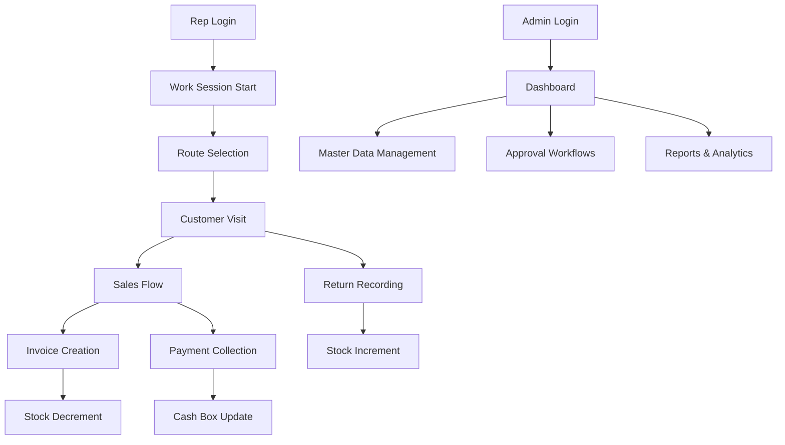
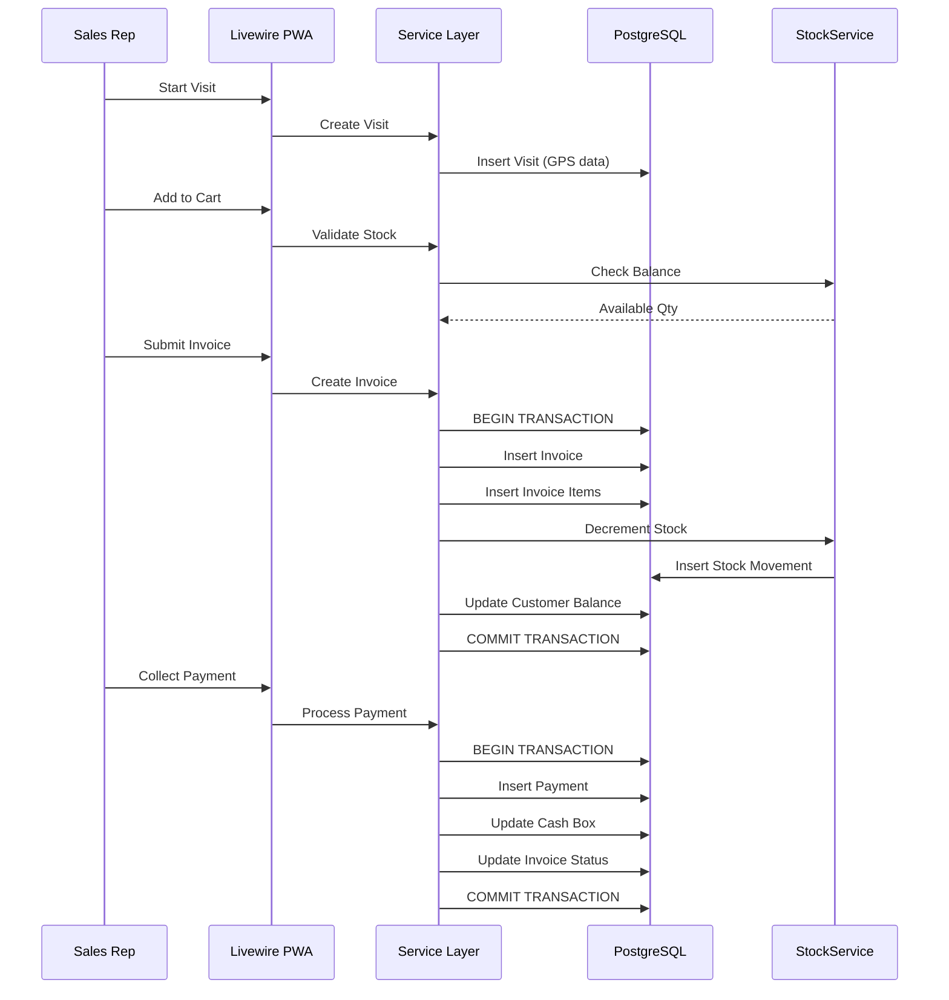

# PROJECT MAP

## Directory and Module Map

```
jawla/
├── app/                          # Laravel application core
│   ├── Console/                  # Artisan commands
│   ├── Data/                     # Data transfer objects
│   ├── Enums/                    # Business state enums
│   ├── Exceptions/               # Domain exceptions
│   ├── Filament/                 # Admin panel (Filament 4)
│   │   ├── Auth/                 # Login/authentication
│   │   ├── Resources/            # 32 CRUD resources
│   │   ├── Pages/                # Dashboard, Reports, CollectPayment
│   │   └── Widgets/              # Dashboard widgets
│   ├── Helpers.php               # Global helper functions
│   ├── Http/                     # Controllers, Middleware, Requests
│   │   ├── Controllers/          # API and web controllers
│   │   ├── Middleware/           # 9 custom middleware
│   │   ├── Requests/            # Form request validation
│   │   └── Resources/           # API resources
│   ├── Livewire/                 # Rep PWA components
│   │   └── App/                  # 20+ Livewire components
│   ├── Models/                   # 85 Eloquent models
│   │   └── Concerns/            # Traits (BelongsToCompany, AppendOnly)
│   ├── Notifications/            # Notification classes
│   ├── Observers/               # Audit observers
│   ├── Policies/                # Authorization policies
│   ├── Providers/               # Service providers
│   ├── Rules/                   # Validation rules
│   ├── Services/                # 56 service classes (business logic)
│   │   ├── Contracts/           # Service interfaces
│   │   ├── Eta/                 # ETA e-invoicing client
│   │   └── Sync/                # Offline sync handlers
│   └── Support/                 # Helper classes
├── config/                       # Laravel configuration
├── database/                     # Migrations, seeders, factories
│   ├── migrations/              # 140 migration files
│   ├── factories/               # Model factories
│   └── seeders/                 # Demo data seeder
├── docs/                         # Documentation (67 files)
├── lang/                         # Translation files (AR/EN)
├── public/                       # Web root, compiled assets
├── resources/                    # Views, JS, CSS
│   ├── views/
│   │   ├── layouts/             # App and admin layouts
│   │   ├── livewire/            # Livewire component views
│   │   └── filament/            # Filament customization
│   └── js/                      # Client-side JavaScript
├── routes/                       # Route definitions
│   ├── web.php                  # Main routes
│   ├── api.php                  # API routes
│   ├── rep-sync.php             # Offline sync endpoint
│   └── rep-offline.php          # Offline snapshot endpoint
├── scripts/                      # Deployment, backup, verify scripts
├── tests/                        # Test suites
│   ├── Feature/                 # 77 feature test files
│   ├── Unit/                    # Unit tests
│   ├── Browser/                 # Playwright E2E tests
│   ├── JavaScript/              # JS tests
│   └── k6/                      # Performance tests
└── vendor/                       # Composer dependencies
```

## Entry Points

### Web Routes (`routes/web.php`)

- `/` - Root redirect
- `/login` - Unified login (reps + admins)
- `/admin/*` - Filament admin panel
- `/app/*` - Rep PWA (Livewire)
- `/health` - Health check endpoint

### Admin Panel (`/admin`)

- `Dashboard` - Overview widgets
- `ReportsPage` - Sales reports
- `CollectPayment` - Admin payment collection
- 32 CRUD resources for master data

### Rep PWA (`/app`)

- `Home` - Today's overview
- `SalesFlow` - Invoice creation wizard
- `CollectPayment` - Payment collection
- `VisitFlow` - Customer visit management
- `StockSearch` - Van inventory lookup

## Component Relationships



## Data Flow Diagram



## Critical Files

### Business Logic (Service Layer)

- `app/Services/InvoiceService.php` - Invoice creation with transactions
- `app/Services/StockService.php` - Stock movement pattern
- `app/Services/PaymentService.php` - Payment collection with idempotency
- `app/Services/VanTransferService.php` - Van stock transfers
- `app/Services/ReturnService.php` - Return processing

### Core Models

- `app/Models/Invoice.php` - Invoice entity with e-invoicing fields
- `app/Models/Customer.php` - Customer with approval workflow
- `app/Models/Visit.php` - Visit with GPS tracking
- `app/Models/Stock.php` - Van inventory
- `app/Models/Payment.php` - Payment with idempotency

### Configuration

- `app/Providers/AppServiceProvider.php` - Service bindings
- `app/Providers/Filament/AdminPanelProvider.php` - Admin panel config
- `config/app.php` - Application configuration
- `config/database.php` - Database connections

### Security

- `app/Http/Middleware/EnsureRepRole.php` - Rep role enforcement
- `app/Http/Middleware/EnsureValidLicense.php` - License validation
- `app/Http/Middleware/EnsureApprovedDevice.php` - Device approval
- `app/Http/Middleware/SecurityHeaders.php` - Security headers

## Change-Sensitive Zones

### High Risk Areas

1. **InvoiceService.php** - Money mutations, stock decrements
2. **StockService.php** - Inventory management, audit trail
3. **PaymentService.php** - Cash collection, balance updates
4. **Database migrations** - Schema changes affect all models
5. **Middleware stack** - Security and authorization

### Medium Risk Areas

1. **Livewire components** - Rep PWA user experience
2. **Filament resources** - Admin panel functionality
3. **E-invoicing integration** - ETA/ZATCA compliance
4. **Offline sync handlers** - Data consistency

### Low Risk Areas

1. **Test files** - No production impact
2. **Documentation** - Reference only
3. **Configuration files** - Environment-specific

## Generated or Protected Areas

### Generated Files (Never Edit)

- `public/build/` - Vite output
- `bootstrap/cache/` - Laravel cache
- `storage/` - Runtime logs, cache, compiled views
- `composer.lock` - Only via `composer install`
- `package-lock.json` - Only via `npm ci`

### Protected Files (No Modification)

- `docs/BUSINESS_RULES.md` - Spec, not implementation
- `docs/SECURITY.md` - Spec, not implementation
- `.env` - Secrets, never committed
- `database/database.sqlite` - Test artifact

### Multi-Tenant Boundaries

- All core tables have `company_id` column
- `BelongsToCompany` trait enforces scoping
- `ActiveCompanyContext` singleton tracks current company
- Cross-company access blocked at service layer

## Key Architectural Patterns

1. **Service Layer Pattern** - All business logic in services
2. **Repository Pattern** - Models as repositories, services as business logic
3. **DTO Pattern** - `app/Data/` for data transfer objects
4. **Observer Pattern** - `app/Observers/` for audit trails
5. **Policy Pattern** - `app/Policies/` for authorization
6. **Contract Pattern** - `app/Services/Contracts/` for service interfaces

## Testing Strategy

- **Unit Tests** - `tests/Unit/` (isolated logic)
- **Feature Tests** - `tests/Feature/` (77 files covering critical flows)
- **Browser Tests** - `tests/Browser/` (Playwright E2E)
- **Performance Tests** - `tests/k6/` (load testing)
- **JavaScript Tests** - `tests/JavaScript/` (PWA offline safety)

## Deployment Configuration

- **Platform:** Railway (config exists in `railway.toml`)
- **Environment:** Production-ready with Sentry integration
- **Database:** PostgreSQL with connection pooling
- **Assets:** Vite-built, served from `public/build/`
- **Queue:** Laravel queue worker for background jobs
- **Logs:** Laravel Pail for real-time log viewing
