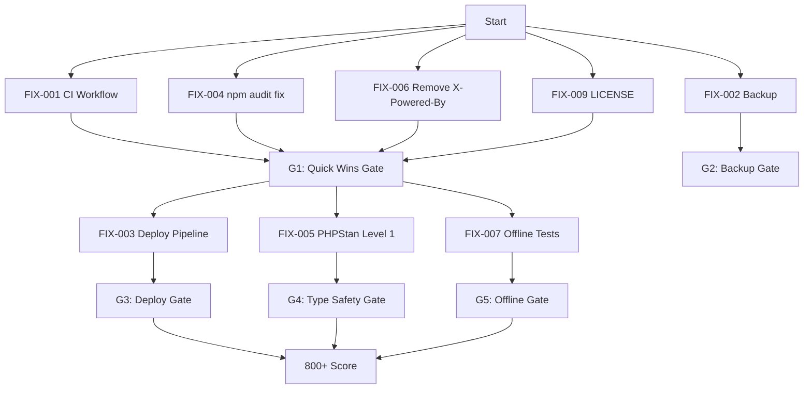

# TASKS: Production Readiness Remediation

**Source:** `.vibeguard/PRODUCTION_READINESS_AUDIT.md`
**Plan:** `docs/PRODUCTION_REMEDIATION_ULTRAPLAN.md`
**Current score:** 700/1000 → **Target:** 800+

---

## Task Graph

---

## Milestone 1: Quick Wins

### FIX-001: GitHub Actions CI Workflow

**Status:** ✅ Complete
**Priority:** P0 (blocker cap)
**Risk:** Low
**Expected gain:** +30-50 points
**Resolves:** REL-002, DEP-001

**What changes:** Create `.github/workflows/ci.yml` — runs on push + PR to `main`.

**Steps:**

1. Checkout code
2. Setup PHP 8.3 + extensions (pgsql, mbstring, xml, zip, bcmath, gd, intl)
3. `composer install --no-progress --prefer-dist`
4. `vendor/bin/pint --test`
5. `vendor/bin/phpstan analyse --level=0`
6. `php artisan test --testsuite=Unit,Feature`
7. Setup Node 20
8. `npm ci`
9. `npm run build`

**Acceptance criteria:**

- [ ] `.github/workflows/ci.yml` exists
- [ ] Workflow runs on `ubuntu-latest`
- [ ] All 9 steps pass on push to `main`

**Verification:** Push to branch, check GitHub Actions tab.

**Files created:** `.github/workflows/ci.yml`

---

### FIX-004: npm Audit Fix

**Status:** ✅ Complete
**Priority:** P1
**Risk:** Low
**Expected gain:** +5-10 points
**Resolves:** SEC-003

**What changes:** Run `npm audit fix` to update nanoid >= 3.3.18.

**Acceptance criteria:**

- [ ] `npm audit --audit-level=high` returns exit code 0
- [ ] nanoid version >= 3.3.18

**Verification:** `npm audit`

---

### FIX-006: Remove X-Powered-By Header

**Status:** ✅ Complete
**Priority:** P1
**Risk:** Low
**Expected gain:** +3-5 points
**Resolves:** SEC-002

**What changes:** In `SecurityHeaders.php`, add `$response->headers->remove('X-Powered-By');`

**Acceptance criteria:**

- [ ] Response header `X-Powered-By` is absent
- [ ] HSTS, CSP, X-Frame-Options, COOP, CORP, Permissions-Policy all still present

**Verification:** `curl -I http://localhost:8000/`

**File modified:** `app/Http/Middleware/SecurityHeaders.php`

---

### FIX-009: Add LICENSE File

**Status:** Pending
**Priority:** P3
**Risk:** Low
**Expected gain:** +3-5 points
**Resolves:** GOV-001

**What changes:** Add `LICENSE` file to repo root.

**Acceptance criteria:**

- [ ] `LICENSE` file exists

**Verification:** `ls LICENSE`

---

## Milestone 2: Backup Strategy

### FIX-002: Automated Postgres Backup

**Status:** Pending
**Priority:** P0
**Risk:** Low
**Expected gain:** +20-30 points
**Resolves:** REL-001

**What changes:** Configure automated database backup.

**Options (pick one):**

1. Railway Postgres PITR (built-in, $0.023/GB/month)
2. `scripts/backup.sh` with pg_dump → Railway volume or S3
3. Railway backup addon

**Acceptance criteria:**

- [ ] Backup runs automatically (daily minimum)
- [ ] Backup can be restored
- [ ] Restore verified with data integrity check

**Verification:** Restore backup to test database, query tables.

**Decision needed:** Which backup method?

---

## Milestone 3: CI/CD Pipeline

### FIX-003: Deploy-on-Push Pipeline

**Status:** Pending
**Priority:** P1
**Risk:** Low
**Expected gain:** +15-25 points
**Resolves:** DEP-001 (partially)
**Depends on:** FIX-001

**What changes:** Create `.github/workflows/deploy.yml` — deploys to Railway on push to `main`.

**Steps:**

1. Run CI (reuse FIX-001 workflow)
2. Install Railway CLI
3. `railway deploy` with environment variables

**Acceptance criteria:**

- [ ] Push to `main` triggers deployment
- [ ] Deployment completes successfully
- [ ] App remains accessible after deploy

**Verification:** Push commit, check Railway dashboard.

**Secrets needed:** `RAILWAY_TOKEN` in GitHub Actions secrets.

**File created:** `.github/workflows/deploy.yml`

---

## Milestone 4: Type Safety

### FIX-005: PHPStan Level 0→1

**Status:** Pending
**Priority:** P2
**Risk:** Medium (may surface errors)
**Expected gain:** +10-15 points
**Resolves:** CODE-001

**What changes:** Change `phpstan.neon` level from 0 to 1. Fix any errors found.

**Acceptance criteria:**

- [ ] `phpstan.neon` level = 1
- [ ] `vendor/bin/phpstan analyse` passes (exit 0)
- [ ] No test regressions

**Verification:** Run phpstan and tests.

**File modified:** `phpstan.neon` (and possibly source files)

---

## Milestone 5: Offline Tests

### FIX-007: Offline Behavior Tests

**Status:** Pending
**Priority:** P3
**Risk:** Medium (E2E tests can be flaky)
**Expected gain:** +10-15 points
**Resolves:** REL-003
**Depends on:** FIX-001

**What changes:** Create Pest browser tests for offline behavior.

**Test cases:**

1. Service worker registers and caches static assets
2. Background sync queues operations when offline
3. Sync completes when connectivity is restored
4. Offline snapshot endpoint returns data

**Acceptance criteria:**

- [ ] `tests/Browser/OfflineSyncTest.php` exists
- [ ] Tests pass in CI (Linux, headless, SQLite)
- [ ] No flaky test failures in 3 consecutive runs

**Verification:** CI passes with new tests.

**File created:** `tests/Browser/OfflineSyncTest.php`

---

## Approval Gates

| Gate | After       | Criteria                                               |
| ---- | ----------- | ------------------------------------------------------ |
| G1   | M1 complete | CI green, npm audit clean, header gone, LICENSE exists |
| G2   | M2 complete | Backup exists, restore verified                        |
| G3   | M3 complete | Deploy-on-push works                                   |
| G4   | M4 complete | PHPStan level 1 passes                                 |
| G5   | M5 complete | Offline tests pass                                     |

**Final gate:** All 5 gates passed → score 800+ → Limited Beta Ready

---

## Risk Register

| Risk                                 | Impact         | Probability | Mitigation                                 |
| ------------------------------------ | -------------- | ----------- | ------------------------------------------ |
| PHPStan level 1 surfaces many errors | Delay          | Medium      | Fix critical ones, leave rest as tech debt |
| Railway token expires in CI          | Deploy failure | Low         | Document rotation schedule                 |
| E2E tests flaky in CI                | CI instability | Medium      | Use retries, headless, SQLite              |
| Backup restore fails                 | Data loss      | Low         | Test monthly, document RTO                 |

---

## Status Tracking

| Task                    | Status   | Assignee | Notes                                      |
| ----------------------- | -------- | -------- | ------------------------------------------ |
| FIX-001 CI Workflow     | ✅ Done  | -        | `.github/workflows/ci.yml` created         |
| FIX-004 npm audit       | ✅ Done  | -        | nanoid patched, 0 vulns                    |
| FIX-006 X-Powered-By    | ✅ Done  | -        | Header removed in SecurityHeaders.php      |
| FIX-009 LICENSE         | Pending  | -        | Needs license type decision                |
| FIX-002 Backup          | Pending  | -        | Needs method decision (PITR/pg_dump/addon) |
| FIX-003 Deploy Pipeline | Pending  | -        | Depends on FIX-001, needs Railway token    |
| FIX-005 PHPStan         | Pending  | -        | Medium risk, may surface errors            |
| FIX-007 Offline Tests   | Pending  | -        | Depends on FIX-001                         |
| FIX-008 Lighthouse      | Deferred | -        | Needs CI first                             |
