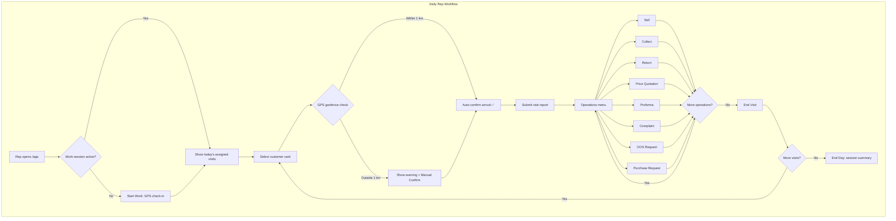
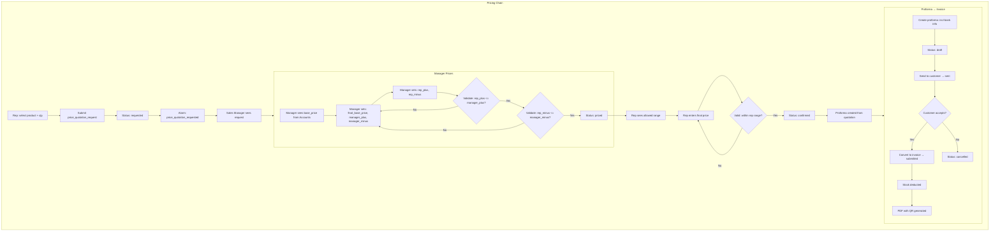
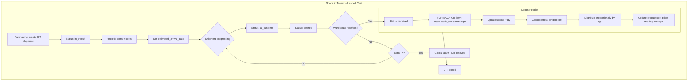
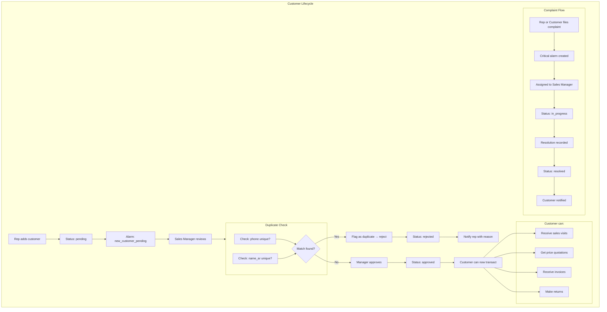
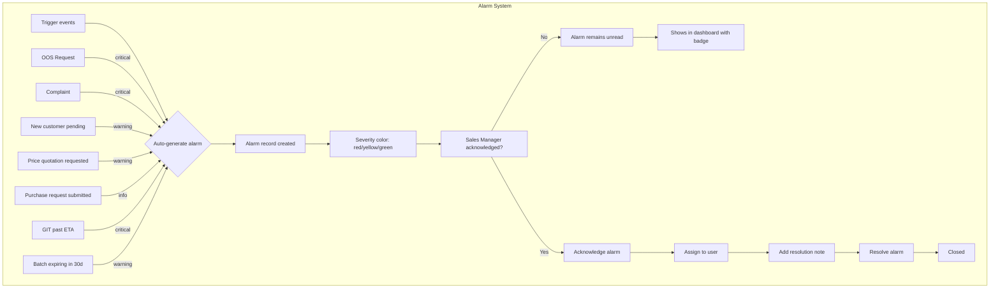
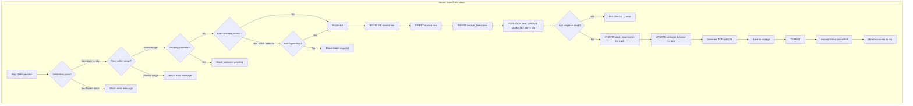

# Jawla (جولة) — BPMN Workflow Diagrams

```mermaid
flowchart TB
    subgraph Procurement_Flow["Procurement Flow"]
        A[Rep: submit purchase request] --> B[Alarm: purchase_request]
        B --> C{Sales manager vetos?}
        C -->|Yes| D[Status: rejected]
        C -->|No| E[Status: approved → Purchasing sees]

        E --> F[Purchasing requests quotes]
        F --> G[Supplier A: quote]
        F --> H[Supplier B: quote]
        F --> I[Supplier C: quote]

        subgraph Comparison["Supplier Comparison"]
            J[Side-by-side view]
            K[Compare: price, currency, payment terms, delivery]
            L[Select best offer]
            M[Status: accepted for chosen]
            N[Status: rejected for others]

            J --> K --> L --> M --> N
        end

        G --> Comparison
        H --> Comparison
        I --> Comparison

        N --> O[Create Purchase Order]
        O --> P[Status: draft]
        P --> Q[Send to supplier → sent]
        Q --> R{Supplier confirms?}
        R -->|Yes| S[Status: confirmed]
        R -->|No| T[Cancel PO]

        S --> U[Receive partial shipment]
        U --> V[Update received_qty on PO items]
        V --> W{All items received?}
        W -->|Yes| X[Status: received]
        W -->|No| U
    end
```

## Workflow Index

| Diagram                 | Description                                                                         | Primary Actors                 |
| ----------------------- | ----------------------------------------------------------------------------------- | ------------------------------ |
| Daily Rep Workflow      | Full day cycle: login → visits → operations → end day                               | Rep                            |
| Pricing Chain           | Multi-level pricing: request → manager prices → rep negotiates → proforma → invoice | Rep, Sales Manager, Accounts   |
| Procurement Flow        | Purchase request → supplier comparison → PO → receipt                               | Rep, Purchasing, Sales Manager |
| GIT + Landed Cost       | International shipment tracking → receipt → cost distribution                       | Purchasing, Warehouse Keeper   |
| Customer Lifecycle      | Rep adds → pending → approve/reject → transactions → complaints                     | Rep, Sales Manager             |
| Alarm System            | 7 triggers → severity → acknowledge → assign → resolve                              | System (auto), Sales Manager   |
| Atomic Sale Transaction | Internal flow for field invoice creation                                            | System (internal)              |
