# Jawla (جولة) — Entity Relationship Diagram

```mermaid
erDiagram
    companies ||--o{ users : has
    companies ||--o{ warehouses : has
    companies ||--o{ product_categories : has
    companies ||--o{ products : has
    companies ||--o{ routes : has
    companies ||--o{ customers : has
    companies ||--o{ suppliers : has
    companies ||--o{ daily_visit_assignments : assigns
    companies ||--o{ price_quotation_requests : has
    companies ||--o{ proforma_invoices : has
    companies ||--o{ invoices : has
    companies ||--o{ payments : has
    companies ||--o{ returns : has
    companies ||--o{ expenses : has
    companies ||--o{ purchase_requests : has
    companies ||--o{ purchase_orders : has
    companies ||--o{ supplier_quotations : has
    companies ||--o{ goods_in_transit : has
    companies ||--o{ alarms : has
    companies ||--o{ out_of_stock_requests : has
    companies ||--o{ complaints : has
    companies ||--o{ van_transfers : has
    companies ||--o{ naming_series : has
    companies ||--o{ tax_templates : has
    companies ||--o{ company_bank_accounts : has
    companies ||--o{ customer_groups : has
    companies ||--o{ territories : has

    users ||--o{ work_sessions : conducts
    users ||--o{ daily_visit_assignments : assigned
    users ||--o{ visits : executes
    users ||--o{ price_quotation_requests : submits
    users ||--o{ proforma_invoices : creates
    users ||--o{ invoices : creates
    users ||--o{ payments : collects
    users ||--o{ returns : processes
    users ||--o{ expenses : logs
    users ||--o{ purchase_requests : submits
    users ||--o{ complaints : logs
    users ||--o{ out_of_stock_requests : creates
    users ||--o{ stock_movements : records
    users ||--o{ cash_boxes : owns
    users ||--o{ warehouses : "owns(van)"
    users ||--o{ route_user : belongs_to
    users ||--o{ van_transfer_from : "from"
    users ||--o{ van_transfer_to : "to"
    users ||--o{ data_migrations : performs

    routes ||--o{ route_user : has
    routes ||--o{ customers : belongs_to

    product_categories ||--o{ products : contains

    products ||--o{ batches : has
    products ||--o{ stocks : tracked_in
    products ||--o{ stock_movements : moved
    products ||--o{ invoice_items : sold_in
    products ||--o{ proforma_invoice_items : quoted_in
    products ||--o{ purchase_request_items : requested_in
    products ||--o{ purchase_order_items : ordered_in
    products ||--o{ supplier_quotations : quoted_in
    products ||--o{ goods_in_transit_items : shipped_in
    products ||--o{ return_items : returned_in
    products ||--o{ out_of_stock_requests : flagged
    products ||--o{ van_transfer_items : transferred_in
    products ||--o{ price_quotation_requests : priced_in
    products ||--o{ product_barcodes : has
    products ||--o{ product_prices : has
    products ||--o{ product_reorder_levels : has
    products ||--o{ quality_inspections : inspected

    batches ||--o{ stocks : present_in
    batches ||--o{ stock_movements : moved
    batches ||--o{ invoice_items : sold_as
    batches ||--o{ goods_in_transit_items : shipped_as
    batches ||--o{ return_items : returned_as
    batches ||--o{ van_transfer_items : transferred_as
    batches ||--o{ quality_inspections : inspected

    warehouses ||--o{ stocks : contains
    warehouses ||--o{ stock_movements : tracks
    warehouses ||--o{ warehouse_import_logs : imports

    customers ||--o{ visits : receives
    customers ||--o{ daily_visit_assignments : planned
    customers ||--o{ price_quotation_requests : requests
    customers ||--o{ proforma_invoices : receives
    customers ||--o{ invoices : receives
    customers ||--o{ payments : makes
    customers ||--o{ returns : makes
    customers ||--o{ complaints : files
    customers ||--o{ out_of_stock_requests : needs
    customers ||--o{ customer_addresses : has
    customers ||--o{ customer_contacts : has
    customers ||--o{ product_prices : has

    customer_groups ||--o{ customers : classifies
    territories ||--o{ customers : locates
    price_lists ||--o{ product_prices : defines
    price_lists ||--o{ customers : assigned

    suppliers ||--o{ purchase_orders : supplies
    suppliers ||--o{ goods_in_transit : ships
    suppliers ||--o{ supplier_quotations : offers
    suppliers ||--o{ batches : provides

    purchase_orders ||--o{ purchase_order_items : contains
    purchase_orders ||--o{ goods_in_transit : references

    goods_in_transit ||--o{ goods_in_transit_items : contains
    goods_in_transit ||--o{ landed_costs : incurs

    proforma_invoices ||--o{ proforma_invoice_items : contains
    proforma_invoices ||--o{ invoices : converts_to

    invoices ||--o{ invoice_items : contains
    invoices ||--o{ invoice_taxes : applied
    invoices ||--o{ payments : pays

    returns ||--o{ return_items : contains

    van_transfers ||--o{ van_transfer_items : contains

    work_sessions ||--o{ visits : groups
    visits ||--o{ visit_reports : has
    visits ||--o{ price_quotation_requests : initiated_in
    visits ||--o{ proforma_invoices : created_in
    visits ||--o{ invoices : created_in
    visits ||--o{ payments : collected_in
    visits ||--o{ returns : processed_in
    visits ||--o{ expenses : incurred_in
    visits ||--o{ complaints : filed_in

    daily_visit_assignments ||--o{ visits : fulfills

    tax_templates ||--o{ tax_template_lines : defines
    invoices ||--o{ invoice_taxes : applies

    quality_inspections ||--o{ inspection_readings : contains

    price_quotation_requests ||--o{ price_quotations : results_in

    purchase_requests ||--o{ supplier_quotations : triggers
```

## Table Count

- **v1 Core (45):** companies, users, warehouses, product_categories, products, batches, stocks, stock_movements, goods_in_transit, goods_in_transit_items, landed_costs, routes, route_user, customers, suppliers, work_sessions, daily_visit_assignments, visits, visit_reports, price_quotation_requests, price_quotations, proforma_invoices, proforma_invoice_items, invoices, invoice_items, invoices_taxes → invoice_taxes, tax_templates, tax_template_lines, company_bank_accounts, payments, modes_of_payment, returns, return_items, expenses, cash_boxes, purchase_requests, purchase_orders, purchase_order_items, supplier_quotations, alarms, out_of_stock_requests, complaints, warehouse_import_logs, van_transfers, van_transfer_items, data_migrations
- **v1 Extensions (12):** customer_groups, territories, customer_addresses, customer_contacts, product_barcodes, product_prices, price_lists, product_reorder_levels, naming_series, quality_inspections, inspection_readings
- **Spatie (5):** permissions, roles, model_has_permissions, model_has_roles, role_has_permissions
- **Total:** ~62 tables

**Legend:**

- All tables use `bigIncrements` IDs
- All money stored as `decimal(12,2)`
- All stock quantities as `decimal(12,3)` (supports fractional tons)
- All tables have `timestamps` (created_at, updated_at)
- Soft deletes (`deleted_at`) on: customers, products, invoices, users
- Foreign keys use `onDelete` appropriate to business logic (cascade for line items, restrict for critical entities)
